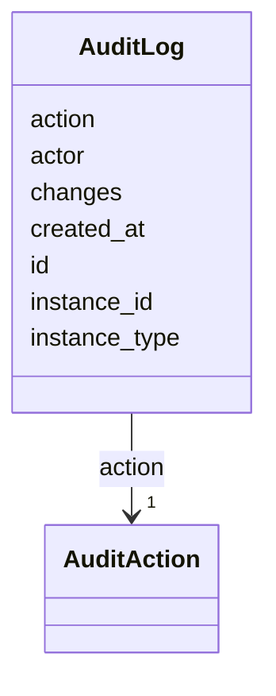

# Class: AuditLog 


_Audit trail entry for curation actions_


URI: [ere:AuditLog](https://data.europa.eu/ers/schema/ere/AuditLog)





<!-- no inheritance hierarchy -->


## Slots

| Name | Cardinality and Range | Description | Inheritance |
| ---  | --- | --- | --- |
| [id](id.md) | 1 <br/> [String](String.md) | Unique identifier for the audit entry | direct |
| [actor](actor.md) | 1 <br/> [String](String.md) | User identifier who performed the action | direct |
| [action](action.md) | 1 <br/> [AuditAction](AuditAction.md) | The action performed | direct |
| [instance_type](instance_type.md) | 1 <br/> [String](String.md) | Type of entity being modified (e | direct |
| [instance_id](instance_id.md) | 1 <br/> [String](String.md) | Identifier of the modified entity | direct |
| [changes](changes.md) | 0..1 <br/> [String](String.md) | JSON representation of action-specific context | direct |
| [created_at](created_at.md) | 1 <br/> [Datetime](Datetime.md) | Timestamp when the action was performed | direct |


## Identifier and Mapping Information


### Schema Source


* from schema: https://data.europa.eu/ers/schema/ere


## Mappings

| Mapping Type | Mapped Value |
| ---  | ---  |
| self | ere:AuditLog |
| native | ere:AuditLog |


## LinkML Source

<!-- TODO: investigate https://stackoverflow.com/questions/37606292/how-to-create-tabbed-code-blocks-in-mkdocs-or-sphinx -->

### Direct

<details>
```yaml
name: AuditLog
description: Audit trail entry for curation actions
from_schema: https://data.europa.eu/ers/schema/ere
attributes:
  id:
    name: id
    description: Unique identifier for the audit entry
    from_schema: https://data.europa.eu/ers/schema/ers
    domain_of:
    - Decision
    - AuditLog
    required: true
  actor:
    name: actor
    description: User identifier who performed the action
    from_schema: https://data.europa.eu/ers/schema/ers
    rank: 1000
    domain_of:
    - AuditLog
    required: true
  action:
    name: action
    description: The action performed
    from_schema: https://data.europa.eu/ers/schema/ers
    domain_of:
    - Decision
    - AuditLog
    range: AuditAction
    required: true
  instance_type:
    name: instance_type
    description: Type of entity being modified (e.g., Decision)
    from_schema: https://data.europa.eu/ers/schema/ers
    rank: 1000
    domain_of:
    - AuditLog
    required: true
  instance_id:
    name: instance_id
    description: Identifier of the modified entity
    from_schema: https://data.europa.eu/ers/schema/ers
    rank: 1000
    domain_of:
    - AuditLog
    required: true
  changes:
    name: changes
    description: JSON representation of action-specific context
    from_schema: https://data.europa.eu/ers/schema/ers
    rank: 1000
    domain_of:
    - AuditLog
  created_at:
    name: created_at
    description: Timestamp when the action was performed
    from_schema: https://data.europa.eu/ers/schema/ers
    domain_of:
    - Decision
    - AuditLog
    range: datetime
    required: true

```
</details>

### Induced

<details>
```yaml
name: AuditLog
description: Audit trail entry for curation actions
from_schema: https://data.europa.eu/ers/schema/ere
attributes:
  id:
    name: id
    description: Unique identifier for the audit entry
    from_schema: https://data.europa.eu/ers/schema/ers
    alias: id
    owner: AuditLog
    domain_of:
    - Decision
    - AuditLog
    range: string
    required: true
  actor:
    name: actor
    description: User identifier who performed the action
    from_schema: https://data.europa.eu/ers/schema/ers
    rank: 1000
    alias: actor
    owner: AuditLog
    domain_of:
    - AuditLog
    range: string
    required: true
  action:
    name: action
    description: The action performed
    from_schema: https://data.europa.eu/ers/schema/ers
    alias: action
    owner: AuditLog
    domain_of:
    - Decision
    - AuditLog
    range: AuditAction
    required: true
  instance_type:
    name: instance_type
    description: Type of entity being modified (e.g., Decision)
    from_schema: https://data.europa.eu/ers/schema/ers
    rank: 1000
    alias: instance_type
    owner: AuditLog
    domain_of:
    - AuditLog
    range: string
    required: true
  instance_id:
    name: instance_id
    description: Identifier of the modified entity
    from_schema: https://data.europa.eu/ers/schema/ers
    rank: 1000
    alias: instance_id
    owner: AuditLog
    domain_of:
    - AuditLog
    range: string
    required: true
  changes:
    name: changes
    description: JSON representation of action-specific context
    from_schema: https://data.europa.eu/ers/schema/ers
    rank: 1000
    alias: changes
    owner: AuditLog
    domain_of:
    - AuditLog
    range: string
  created_at:
    name: created_at
    description: Timestamp when the action was performed
    from_schema: https://data.europa.eu/ers/schema/ers
    alias: created_at
    owner: AuditLog
    domain_of:
    - Decision
    - AuditLog
    range: datetime
    required: true

```
</details>