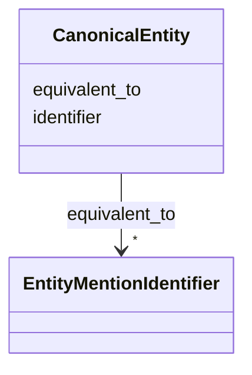

# Class: CanonicalEntity 


_A logical identity construct providing a stable identity anchor._

_Represents a cluster of equivalent entity mentions._

__


URI: [ere:CanonicalEntity](https://data.europa.eu/ers/schema/ere/CanonicalEntity)





<!-- no inheritance hierarchy -->


## Slots

| Name | Cardinality and Range | Description | Inheritance |
| ---  | --- | --- | --- |
| [identifier](identifier.md) | 1 <br/> [String](String.md) | Unique identifier for the canonical entity | direct |
| [equivalent_to](equivalent_to.md) | * <br/> [EntityMentionIdentifier](EntityMentionIdentifier.md) | Entity mentions that have been resolved to this canonical entity | direct |


## Identifier and Mapping Information


### Schema Source


* from schema: https://data.europa.eu/ers/schema/ere


## Mappings

| Mapping Type | Mapped Value |
| ---  | ---  |
| self | ere:CanonicalEntity |
| native | ere:CanonicalEntity |


## LinkML Source

<!-- TODO: investigate https://stackoverflow.com/questions/37606292/how-to-create-tabbed-code-blocks-in-mkdocs-or-sphinx -->

### Direct

<details>
```yaml
name: CanonicalEntity
description: 'A logical identity construct providing a stable identity anchor.

  Represents a cluster of equivalent entity mentions.

  '
from_schema: https://data.europa.eu/ers/schema/ere
attributes:
  identifier:
    name: identifier
    description: Unique identifier for the canonical entity.
    from_schema: https://data.europa.eu/ers/schema/ers
    rank: 1000
    domain_of:
    - CanonicalEntity
    - EntityMention
    required: true
  equivalent_to:
    name: equivalent_to
    description: Entity mentions that have been resolved to this canonical entity.
    from_schema: https://data.europa.eu/ers/schema/ers
    rank: 1000
    domain_of:
    - CanonicalEntity
    range: EntityMentionIdentifier
    multivalued: true

```
</details>

### Induced

<details>
```yaml
name: CanonicalEntity
description: 'A logical identity construct providing a stable identity anchor.

  Represents a cluster of equivalent entity mentions.

  '
from_schema: https://data.europa.eu/ers/schema/ere
attributes:
  identifier:
    name: identifier
    description: Unique identifier for the canonical entity.
    from_schema: https://data.europa.eu/ers/schema/ers
    rank: 1000
    alias: identifier
    owner: CanonicalEntity
    domain_of:
    - CanonicalEntity
    - EntityMention
    range: string
    required: true
  equivalent_to:
    name: equivalent_to
    description: Entity mentions that have been resolved to this canonical entity.
    from_schema: https://data.europa.eu/ers/schema/ers
    rank: 1000
    alias: equivalent_to
    owner: CanonicalEntity
    domain_of:
    - CanonicalEntity
    range: EntityMentionIdentifier
    multivalued: true

```
</details>