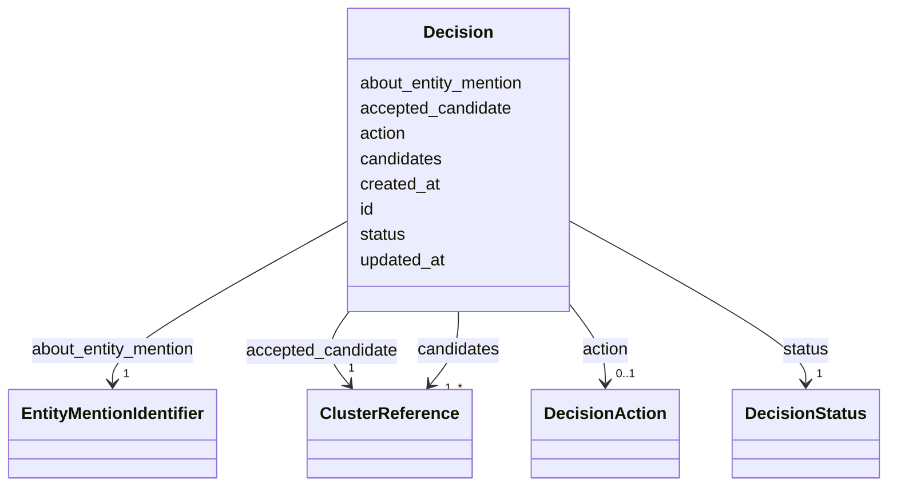

# Class: Decision 


_Aggregate root representing a resolution decision requiring curation._

_Captures the state and outcome of entity mention resolution._

__


URI: [ere:Decision](https://data.europa.eu/ers/schema/ere/Decision)





<!-- no inheritance hierarchy -->


## Slots

| Name | Cardinality and Range | Description | Inheritance |
| ---  | --- | --- | --- |
| [id](id.md) | 1 <br/> [String](String.md) | Unique identifier for the decision | direct |
| [about_entity_mention](about_entity_mention.md) | 1 <br/> [EntityMentionIdentifier](EntityMentionIdentifier.md) | Reference to the entity mention being resolved | direct |
| [status](status.md) | 1 <br/> [DecisionStatus](DecisionStatus.md) | Current status in the curation workflow | direct |
| [action](action.md) | 0..1 <br/> [DecisionAction](DecisionAction.md) | Action taken by curator | direct |
| [accepted_candidate](accepted_candidate.md) | 1 <br/> [ClusterReference](ClusterReference.md) | The cluster reference accepted for this entity mention | direct |
| [candidates](candidates.md) | 1..* <br/> [ClusterReference](ClusterReference.md) | All cluster references proposed by ERE, ordered by confidence | direct |
| [created_at](created_at.md) | 1 <br/> [Datetime](Datetime.md) | Timestamp when the decision was created | direct |
| [updated_at](updated_at.md) | 0..1 <br/> [Datetime](Datetime.md) | Timestamp when the decision was last updated | direct |


## Identifier and Mapping Information


### Schema Source


* from schema: https://data.europa.eu/ers/schema/ere


## Mappings

| Mapping Type | Mapped Value |
| ---  | ---  |
| self | ere:Decision |
| native | ere:Decision |


## LinkML Source

<!-- TODO: investigate https://stackoverflow.com/questions/37606292/how-to-create-tabbed-code-blocks-in-mkdocs-or-sphinx -->

### Direct

<details>
```yaml
name: Decision
description: 'Aggregate root representing a resolution decision requiring curation.

  Captures the state and outcome of entity mention resolution.

  '
from_schema: https://data.europa.eu/ers/schema/ere
attributes:
  id:
    name: id
    description: Unique identifier for the decision
    from_schema: https://data.europa.eu/ers/schema/ers
    rank: 1000
    domain_of:
    - Decision
    - AuditLog
    required: true
  about_entity_mention:
    name: about_entity_mention
    description: Reference to the entity mention being resolved
    from_schema: https://data.europa.eu/ers/schema/ers
    rank: 1000
    domain_of:
    - Decision
    range: EntityMentionIdentifier
    required: true
  status:
    name: status
    description: Current status in the curation workflow
    from_schema: https://data.europa.eu/ers/schema/ers
    rank: 1000
    domain_of:
    - Decision
    range: DecisionStatus
    required: true
  action:
    name: action
    description: Action taken by curator
    from_schema: https://data.europa.eu/ers/schema/ers
    rank: 1000
    domain_of:
    - Decision
    - AuditLog
    range: DecisionAction
  accepted_candidate:
    name: accepted_candidate
    description: The cluster reference accepted for this entity mention
    from_schema: https://data.europa.eu/ers/schema/ers
    rank: 1000
    domain_of:
    - Decision
    range: ClusterReference
    required: true
  candidates:
    name: candidates
    description: All cluster references proposed by ERE, ordered by confidence
    from_schema: https://data.europa.eu/ers/schema/ers
    domain_of:
    - EntityMentionResolutionResponse
    - Decision
    range: ClusterReference
    required: true
    multivalued: true
  created_at:
    name: created_at
    description: Timestamp when the decision was created
    from_schema: https://data.europa.eu/ers/schema/ers
    rank: 1000
    domain_of:
    - Decision
    - AuditLog
    range: datetime
    required: true
  updated_at:
    name: updated_at
    description: Timestamp when the decision was last updated
    from_schema: https://data.europa.eu/ers/schema/ers
    rank: 1000
    domain_of:
    - Decision
    range: datetime

```
</details>

### Induced

<details>
```yaml
name: Decision
description: 'Aggregate root representing a resolution decision requiring curation.

  Captures the state and outcome of entity mention resolution.

  '
from_schema: https://data.europa.eu/ers/schema/ere
attributes:
  id:
    name: id
    description: Unique identifier for the decision
    from_schema: https://data.europa.eu/ers/schema/ers
    rank: 1000
    alias: id
    owner: Decision
    domain_of:
    - Decision
    - AuditLog
    range: string
    required: true
  about_entity_mention:
    name: about_entity_mention
    description: Reference to the entity mention being resolved
    from_schema: https://data.europa.eu/ers/schema/ers
    rank: 1000
    alias: about_entity_mention
    owner: Decision
    domain_of:
    - Decision
    range: EntityMentionIdentifier
    required: true
  status:
    name: status
    description: Current status in the curation workflow
    from_schema: https://data.europa.eu/ers/schema/ers
    rank: 1000
    alias: status
    owner: Decision
    domain_of:
    - Decision
    range: DecisionStatus
    required: true
  action:
    name: action
    description: Action taken by curator
    from_schema: https://data.europa.eu/ers/schema/ers
    rank: 1000
    alias: action
    owner: Decision
    domain_of:
    - Decision
    - AuditLog
    range: DecisionAction
  accepted_candidate:
    name: accepted_candidate
    description: The cluster reference accepted for this entity mention
    from_schema: https://data.europa.eu/ers/schema/ers
    rank: 1000
    alias: accepted_candidate
    owner: Decision
    domain_of:
    - Decision
    range: ClusterReference
    required: true
  candidates:
    name: candidates
    description: All cluster references proposed by ERE, ordered by confidence
    from_schema: https://data.europa.eu/ers/schema/ers
    alias: candidates
    owner: Decision
    domain_of:
    - EntityMentionResolutionResponse
    - Decision
    range: ClusterReference
    required: true
    multivalued: true
  created_at:
    name: created_at
    description: Timestamp when the decision was created
    from_schema: https://data.europa.eu/ers/schema/ers
    rank: 1000
    alias: created_at
    owner: Decision
    domain_of:
    - Decision
    - AuditLog
    range: datetime
    required: true
  updated_at:
    name: updated_at
    description: Timestamp when the decision was last updated
    from_schema: https://data.europa.eu/ers/schema/ers
    rank: 1000
    alias: updated_at
    owner: Decision
    domain_of:
    - Decision
    range: datetime

```
</details>