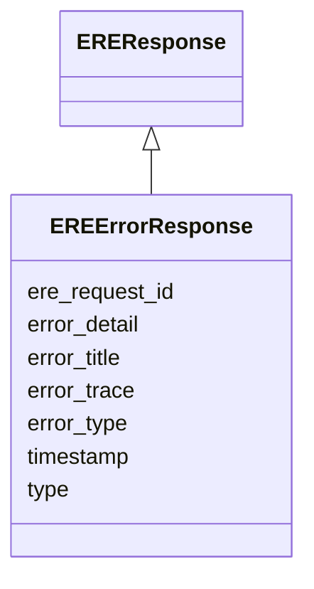

# Class: EREErrorResponse 


_Response sent by the ERE when some error/exception occurs while processing a request._

_For instance, this may happen if the request is malformed or some internal error happens._

__

_The attributes of this class are based on [RFC-9457](https://datatracker.ietf.org/doc/html/rfc9457)._

__


URI: [ere:EREErrorResponse](https://data.europa.eu/ers/schema/ere/EREErrorResponse)





## Inheritance
* [EREMessage](EREMessage.md)
    * [EREResponse](EREResponse.md)
        * **EREErrorResponse**


## Slots

| Name | Cardinality and Range | Description | Inheritance |
| ---  | --- | --- | --- |
| [error_type](error_type.md) | 1 <br/> [String](String.md) | A string representing the error type, eg, the FQN of the raised exception | direct |
| [error_title](error_title.md) | 0..1 <br/> [String](String.md) | A human readable brief message about the error that occurred | direct |
| [error_detail](error_detail.md) | 0..1 <br/> [String](String.md) | A human readable detailed message about the error that occurred | direct |
| [error_trace](error_trace.md) | 0..1 <br/> [String](String.md) | A string representing a (stack) trace of the error that occurred | direct |
| [type](type.md) | 1 <br/> [String](String.md) | The type of the request or result | [EREMessage](EREMessage.md) |
| [ere_request_id](ere_request_id.md) | 1 <br/> [String](String.md) | A string representing the unique ID of an ERE request, or the ID of the reque... | [EREMessage](EREMessage.md) |
| [timestamp](timestamp.md) | 0..1 <br/> [Datetime](Datetime.md) | The time when the message was created | [EREMessage](EREMessage.md) |


## Examples

| Value |
| --- |
| {
  "type": "EREErrorResponse",
  "request_id": "324fs3r345vx",
  "error_type": "ere.exceptions.MalformedRequestError",
  "error_title": "The entity data is missing in the request",
  "error_detail": "The 'entity' attribute is required in EntityMentionResolutionRequest message",
  // Optional and not recommended for production use
  "error_trace": "Traceback (most recent call last):\n  File \"/app/ere/service.py\", line 45, in process_request\n..."
}
 |

## Identifier and Mapping Information


### Schema Source


* from schema: https://data.europa.eu/ers/schema/ere


## Mappings

| Mapping Type | Mapped Value |
| ---  | ---  |
| self | ere:EREErrorResponse |
| native | ere:EREErrorResponse |


## LinkML Source

<!-- TODO: investigate https://stackoverflow.com/questions/37606292/how-to-create-tabbed-code-blocks-in-mkdocs-or-sphinx -->

### Direct

<details>
```yaml
name: EREErrorResponse
description: 'Response sent by the ERE when some error/exception occurs while processing
  a request.

  For instance, this may happen if the request is malformed or some internal error
  happens.


  The attributes of this class are based on [RFC-9457](https://datatracker.ietf.org/doc/html/rfc9457).

  '
examples:
- value: "{\n  \"type\": \"EREErrorResponse\",\n  \"request_id\": \"324fs3r345vx\"\
    ,\n  \"error_type\": \"ere.exceptions.MalformedRequestError\",\n  \"error_title\"\
    : \"The entity data is missing in the request\",\n  \"error_detail\": \"The 'entity'\
    \ attribute is required in EntityMentionResolutionRequest message\",\n  // Optional\
    \ and not recommended for production use\n  \"error_trace\": \"Traceback (most\
    \ recent call last):\\n  File \\\"/app/ere/service.py\\\", line 45, in process_request\\\
    n...\"\n}\n"
from_schema: https://data.europa.eu/ers/schema/ere
is_a: EREResponse
attributes:
  error_type:
    name: error_type
    description: 'A string representing the error type, eg, the FQN of the raised
      exception.


      This corresponds to RFC-9457''s `type`.

      '
    from_schema: https://data.europa.eu/ers/schema/ere
    rank: 1000
    domain_of:
    - EREErrorResponse
    required: true
  error_title:
    name: error_title
    description: 'A human readable brief message about the error that occurred.


      This corresponds to RFC-9457''s `title`.

      '
    from_schema: https://data.europa.eu/ers/schema/ere
    rank: 1000
    domain_of:
    - EREErrorResponse
  error_detail:
    name: error_detail
    description: 'A human readable detailed message about the error that occurred.


      This corresponds to RFC-9457''s `detail`.

      '
    from_schema: https://data.europa.eu/ers/schema/ere
    rank: 1000
    domain_of:
    - EREErrorResponse
  error_trace:
    name: error_trace
    description: 'A string representing a (stack) trace of the error that occurred.


      This is optional and typically used for debugging purposes only, since

      exposing this kind of server-side information is a security risk.

      '
    from_schema: https://data.europa.eu/ers/schema/ere
    rank: 1000
    domain_of:
    - EREErrorResponse

```
</details>

### Induced

<details>
```yaml
name: EREErrorResponse
description: 'Response sent by the ERE when some error/exception occurs while processing
  a request.

  For instance, this may happen if the request is malformed or some internal error
  happens.


  The attributes of this class are based on [RFC-9457](https://datatracker.ietf.org/doc/html/rfc9457).

  '
examples:
- value: "{\n  \"type\": \"EREErrorResponse\",\n  \"request_id\": \"324fs3r345vx\"\
    ,\n  \"error_type\": \"ere.exceptions.MalformedRequestError\",\n  \"error_title\"\
    : \"The entity data is missing in the request\",\n  \"error_detail\": \"The 'entity'\
    \ attribute is required in EntityMentionResolutionRequest message\",\n  // Optional\
    \ and not recommended for production use\n  \"error_trace\": \"Traceback (most\
    \ recent call last):\\n  File \\\"/app/ere/service.py\\\", line 45, in process_request\\\
    n...\"\n}\n"
from_schema: https://data.europa.eu/ers/schema/ere
is_a: EREResponse
attributes:
  error_type:
    name: error_type
    description: 'A string representing the error type, eg, the FQN of the raised
      exception.


      This corresponds to RFC-9457''s `type`.

      '
    from_schema: https://data.europa.eu/ers/schema/ere
    rank: 1000
    alias: error_type
    owner: EREErrorResponse
    domain_of:
    - EREErrorResponse
    range: string
    required: true
  error_title:
    name: error_title
    description: 'A human readable brief message about the error that occurred.


      This corresponds to RFC-9457''s `title`.

      '
    from_schema: https://data.europa.eu/ers/schema/ere
    rank: 1000
    alias: error_title
    owner: EREErrorResponse
    domain_of:
    - EREErrorResponse
    range: string
  error_detail:
    name: error_detail
    description: 'A human readable detailed message about the error that occurred.


      This corresponds to RFC-9457''s `detail`.

      '
    from_schema: https://data.europa.eu/ers/schema/ere
    rank: 1000
    alias: error_detail
    owner: EREErrorResponse
    domain_of:
    - EREErrorResponse
    range: string
  error_trace:
    name: error_trace
    description: 'A string representing a (stack) trace of the error that occurred.


      This is optional and typically used for debugging purposes only, since

      exposing this kind of server-side information is a security risk.

      '
    from_schema: https://data.europa.eu/ers/schema/ere
    rank: 1000
    alias: error_trace
    owner: EREErrorResponse
    domain_of:
    - EREErrorResponse
    range: string
  type:
    name: type
    description: "The type of the request or result.\n\nAs per LinkML specification,\
      \ `designates_type` is used here in order to allow for this\nslot to tell the\
      \ concrete subclass that an instance (such as a JSON object) belongs to.\n\n\
      In other words, a particular request will have `type` set with values like \n\
      `EntityMentionResolutionRequest` or `EntityResolutionResult`\n"
    from_schema: https://data.europa.eu/ers/schema/ere
    rank: 1000
    designates_type: true
    alias: type
    owner: EREErrorResponse
    domain_of:
    - EREMessage
    range: string
    required: true
  ere_request_id:
    name: ere_request_id
    description: 'A string representing the unique ID of an ERE request, or the ID
      of the request a response is about.

      This **is not** the same as `request_id` + `source_id`.

      '
    from_schema: https://data.europa.eu/ers/schema/ere
    rank: 1000
    alias: ere_request_id
    owner: EREErrorResponse
    domain_of:
    - EREMessage
    range: string
    required: true
  timestamp:
    name: timestamp
    description: 'The time when the message was created. Should be in ISO-8601 format.

      '
    from_schema: https://data.europa.eu/ers/schema/ere
    rank: 1000
    alias: timestamp
    owner: EREErrorResponse
    domain_of:
    - EREMessage
    range: datetime

```
</details>