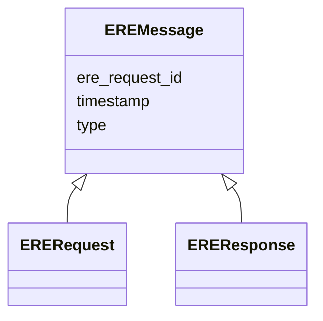

# Class: EREMessage 


_Root abstraction to represent attributes common to both requests and results._

_This is modelled as a mixin in LinkML (so that it can't be instantiated directly)._

__


* __NOTE__: this is an abstract class and should not be instantiated directly


URI: [ere:EREMessage](https://data.europa.eu/ers/schema/ere/EREMessage)





## Inheritance
* **EREMessage**
    * [ERERequest](ERERequest.md)
    * [EREResponse](EREResponse.md)


## Slots

| Name | Cardinality and Range | Description | Inheritance |
| ---  | --- | --- | --- |
| [type](type.md) | 1 <br/> [String](String.md) | The type of the request or result | direct |
| [ere_request_id](ere_request_id.md) | 1 <br/> [String](String.md) | A string representing the unique ID of an ERE request, or the ID of the reque... | direct |
| [timestamp](timestamp.md) | 0..1 <br/> [Datetime](Datetime.md) | The time when the message was created | direct |


## Identifier and Mapping Information


### Schema Source


* from schema: https://data.europa.eu/ers/schema/ere


## Mappings

| Mapping Type | Mapped Value |
| ---  | ---  |
| self | ere:EREMessage |
| native | ere:EREMessage |


## LinkML Source

<!-- TODO: investigate https://stackoverflow.com/questions/37606292/how-to-create-tabbed-code-blocks-in-mkdocs-or-sphinx -->

### Direct

<details>
```yaml
name: EREMessage
description: 'Root abstraction to represent attributes common to both requests and
  results.

  This is modelled as a mixin in LinkML (so that it can''t be instantiated directly).

  '
from_schema: https://data.europa.eu/ers/schema/ere
abstract: true
attributes:
  type:
    name: type
    description: "The type of the request or result.\n\nAs per LinkML specification,\
      \ `designates_type` is used here in order to allow for this\nslot to tell the\
      \ concrete subclass that an instance (such as a JSON object) belongs to.\n\n\
      In other words, a particular request will have `type` set with values like \n\
      `EntityMentionResolutionRequest` or `EntityResolutionResult`\n"
    from_schema: https://data.europa.eu/ers/schema/ere
    rank: 1000
    designates_type: true
    domain_of:
    - EREMessage
    required: true
  ere_request_id:
    name: ere_request_id
    description: 'A string representing the unique ID of an ERE request, or the ID
      of the request a response is about.

      This **is not** the same as `request_id` + `source_id`.

      '
    from_schema: https://data.europa.eu/ers/schema/ere
    rank: 1000
    domain_of:
    - EREMessage
    required: true
  timestamp:
    name: timestamp
    description: 'The time when the message was created. Should be in ISO-8601 format.

      '
    from_schema: https://data.europa.eu/ers/schema/ere
    rank: 1000
    domain_of:
    - EREMessage
    range: datetime

```
</details>

### Induced

<details>
```yaml
name: EREMessage
description: 'Root abstraction to represent attributes common to both requests and
  results.

  This is modelled as a mixin in LinkML (so that it can''t be instantiated directly).

  '
from_schema: https://data.europa.eu/ers/schema/ere
abstract: true
attributes:
  type:
    name: type
    description: "The type of the request or result.\n\nAs per LinkML specification,\
      \ `designates_type` is used here in order to allow for this\nslot to tell the\
      \ concrete subclass that an instance (such as a JSON object) belongs to.\n\n\
      In other words, a particular request will have `type` set with values like \n\
      `EntityMentionResolutionRequest` or `EntityResolutionResult`\n"
    from_schema: https://data.europa.eu/ers/schema/ere
    rank: 1000
    designates_type: true
    alias: type
    owner: EREMessage
    domain_of:
    - EREMessage
    range: string
    required: true
  ere_request_id:
    name: ere_request_id
    description: 'A string representing the unique ID of an ERE request, or the ID
      of the request a response is about.

      This **is not** the same as `request_id` + `source_id`.

      '
    from_schema: https://data.europa.eu/ers/schema/ere
    rank: 1000
    alias: ere_request_id
    owner: EREMessage
    domain_of:
    - EREMessage
    range: string
    required: true
  timestamp:
    name: timestamp
    description: 'The time when the message was created. Should be in ISO-8601 format.

      '
    from_schema: https://data.europa.eu/ers/schema/ere
    rank: 1000
    alias: timestamp
    owner: EREMessage
    domain_of:
    - EREMessage
    range: datetime

```
</details>