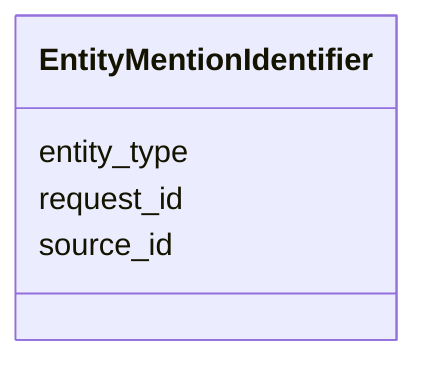

# Class: EntityMentionIdentifier 


_A container that groups the attributes needed to identify an entity mention in a resolution request_

_or response._

__

_As per ERS architectural decision, in the whole ERS and ERE systems, there is always a deterministic_

_method to build a canonical identifier from the combination of `sourceId`, `requestId` and `entityType`_

_(eg, string concatenation plus some prefix). Similarly, a cluster ID (mentioned in various places in _

_in this hereby ERE service schema) can be built from an entity that is initially the only cluster member._

__


URI: [ere:EntityMentionIdentifier](https://data.europa.eu/ers/schema/ere/EntityMentionIdentifier)





<!-- no inheritance hierarchy -->


## Slots

| Name | Cardinality and Range | Description | Inheritance |
| ---  | --- | --- | --- |
| [source_id](source_id.md) | 1 <br/> [String](String.md) | The ID or URI of the ERS client that originated the request | direct |
| [request_id](request_id.md) | 1 <br/> [String](String.md) | A string representing the unique ID of the request made to the ERS system | direct |
| [entity_type](entity_type.md) | 1 <br/> [String](String.md) | A string representing the entity type (based on CET) | direct |


## Usages

| used by | used in | type | used |
| ---  | --- | --- | --- |
| [EntityMentionResolutionResponse](EntityMentionResolutionResponse.md) | [entity_mention_id](entity_mention_id.md) | range | [EntityMentionIdentifier](EntityMentionIdentifier.md) |
| [CanonicalEntity](CanonicalEntity.md) | [equivalent_to](equivalent_to.md) | range | [EntityMentionIdentifier](EntityMentionIdentifier.md) |
| [EntityMention](EntityMention.md) | [identifier](identifier.md) | range | [EntityMentionIdentifier](EntityMentionIdentifier.md) |
| [Decision](Decision.md) | [about_entity_mention](about_entity_mention.md) | range | [EntityMentionIdentifier](EntityMentionIdentifier.md) |


## Identifier and Mapping Information


### Schema Source


* from schema: https://data.europa.eu/ers/schema/ere


## Mappings

| Mapping Type | Mapped Value |
| ---  | ---  |
| self | ere:EntityMentionIdentifier |
| native | ere:EntityMentionIdentifier |


## LinkML Source

<!-- TODO: investigate https://stackoverflow.com/questions/37606292/how-to-create-tabbed-code-blocks-in-mkdocs-or-sphinx -->

### Direct

<details>
```yaml
name: EntityMentionIdentifier
description: "A container that groups the attributes needed to identify an entity\
  \ mention in a resolution request\nor response.\n\nAs per ERS architectural decision,\
  \ in the whole ERS and ERE systems, there is always a deterministic\nmethod to build\
  \ a canonical identifier from the combination of `sourceId`, `requestId` and `entityType`\n\
  (eg, string concatenation plus some prefix). Similarly, a cluster ID (mentioned\
  \ in various places in \nin this hereby ERE service schema) can be built from an\
  \ entity that is initially the only cluster member.\n"
from_schema: https://data.europa.eu/ers/schema/ere
attributes:
  source_id:
    name: source_id
    description: "The ID or URI of the ERS client that originated the request. This\
      \ identifies an application or a \nperson accessing the ERS system.\n"
    from_schema: https://data.europa.eu/ers/schema/ers
    rank: 1000
    domain_of:
    - EntityMentionIdentifier
    required: true
  request_id:
    name: request_id
    description: "A string representing the unique ID of the request made to the ERS\
      \ system. In general, this is unique\nonly within the scope of the source and\
      \ the entity type, ie, within `sourceId` and `entityType`. \n\nMoreover, this\
      \ is **not** the same as `ereRequestId`, which instead, is internal to the ERE\
      \ and is \nused to match responses to requests.\n"
    from_schema: https://data.europa.eu/ers/schema/ers
    rank: 1000
    domain_of:
    - EntityMentionIdentifier
    range: string
    required: true
  entity_type:
    name: entity_type
    description: "A string representing the entity type (based on CET). This is typically\
      \ a URI.\n\nNote that this is at this level, and not at `EntityMention`, since,\
      \ as said above, \nit's needed to identify the entity, even when its content\
      \ is not present. For the same\nreason, it's used both for `EREResolutionRequest`\
      \ and `EREResolutionResponse` messages.,\n"
    from_schema: https://data.europa.eu/ers/schema/ers
    rank: 1000
    domain_of:
    - EntityMentionIdentifier
    required: true

```
</details>

### Induced

<details>
```yaml
name: EntityMentionIdentifier
description: "A container that groups the attributes needed to identify an entity\
  \ mention in a resolution request\nor response.\n\nAs per ERS architectural decision,\
  \ in the whole ERS and ERE systems, there is always a deterministic\nmethod to build\
  \ a canonical identifier from the combination of `sourceId`, `requestId` and `entityType`\n\
  (eg, string concatenation plus some prefix). Similarly, a cluster ID (mentioned\
  \ in various places in \nin this hereby ERE service schema) can be built from an\
  \ entity that is initially the only cluster member.\n"
from_schema: https://data.europa.eu/ers/schema/ere
attributes:
  source_id:
    name: source_id
    description: "The ID or URI of the ERS client that originated the request. This\
      \ identifies an application or a \nperson accessing the ERS system.\n"
    from_schema: https://data.europa.eu/ers/schema/ers
    rank: 1000
    alias: source_id
    owner: EntityMentionIdentifier
    domain_of:
    - EntityMentionIdentifier
    range: string
    required: true
  request_id:
    name: request_id
    description: "A string representing the unique ID of the request made to the ERS\
      \ system. In general, this is unique\nonly within the scope of the source and\
      \ the entity type, ie, within `sourceId` and `entityType`. \n\nMoreover, this\
      \ is **not** the same as `ereRequestId`, which instead, is internal to the ERE\
      \ and is \nused to match responses to requests.\n"
    from_schema: https://data.europa.eu/ers/schema/ers
    rank: 1000
    alias: request_id
    owner: EntityMentionIdentifier
    domain_of:
    - EntityMentionIdentifier
    range: string
    required: true
  entity_type:
    name: entity_type
    description: "A string representing the entity type (based on CET). This is typically\
      \ a URI.\n\nNote that this is at this level, and not at `EntityMention`, since,\
      \ as said above, \nit's needed to identify the entity, even when its content\
      \ is not present. For the same\nreason, it's used both for `EREResolutionRequest`\
      \ and `EREResolutionResponse` messages.,\n"
    from_schema: https://data.europa.eu/ers/schema/ers
    rank: 1000
    alias: entity_type
    owner: EntityMentionIdentifier
    domain_of:
    - EntityMentionIdentifier
    range: string
    required: true

```
</details>