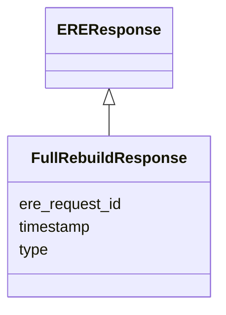

# Class: FullRebuildResponse 


_A response to a `FullRebuildRequest`, confirming that the rebuild process has started._

__

_As for all the requests, this carries the `ere_request_id`, which matches the full rebuild _

_request being acknowledged._

__


URI: [ere:FullRebuildResponse](https://data.europa.eu/ers/schema/ere/FullRebuildResponse)





## Inheritance
* [EREMessage](EREMessage.md)
    * [EREResponse](EREResponse.md)
        * **FullRebuildResponse**


## Slots

| Name | Cardinality and Range | Description | Inheritance |
| ---  | --- | --- | --- |
| [type](type.md) | 1 <br/> [String](String.md) | The type of the request or result | [EREMessage](EREMessage.md) |
| [ere_request_id](ere_request_id.md) | 1 <br/> [String](String.md) | A string representing the unique ID of an ERE request, or the ID of the reque... | [EREMessage](EREMessage.md) |
| [timestamp](timestamp.md) | 0..1 <br/> [Datetime](Datetime.md) | The time when the message was created | [EREMessage](EREMessage.md) |


## Identifier and Mapping Information


### Schema Source


* from schema: https://data.europa.eu/ers/schema/ere


## Mappings

| Mapping Type | Mapped Value |
| ---  | ---  |
| self | ere:FullRebuildResponse |
| native | ere:FullRebuildResponse |


## LinkML Source

<!-- TODO: investigate https://stackoverflow.com/questions/37606292/how-to-create-tabbed-code-blocks-in-mkdocs-or-sphinx -->

### Direct

<details>
```yaml
name: FullRebuildResponse
description: "A response to a `FullRebuildRequest`, confirming that the rebuild process\
  \ has started.\n\nAs for all the requests, this carries the `ere_request_id`, which\
  \ matches the full rebuild \nrequest being acknowledged.\n"
from_schema: https://data.europa.eu/ers/schema/ere
is_a: EREResponse

```
</details>

### Induced

<details>
```yaml
name: FullRebuildResponse
description: "A response to a `FullRebuildRequest`, confirming that the rebuild process\
  \ has started.\n\nAs for all the requests, this carries the `ere_request_id`, which\
  \ matches the full rebuild \nrequest being acknowledged.\n"
from_schema: https://data.europa.eu/ers/schema/ere
is_a: EREResponse
attributes:
  type:
    name: type
    description: "The type of the request or result.\n\nAs per LinkML specification,\
      \ `designates_type` is used here in order to allow for this\nslot to tell the\
      \ concrete subclass that an instance (such as a JSON object) belongs to.\n\n\
      In other words, a particular request will have `type` set with values like \n\
      `EntityMentionResolutionRequest` or `EntityResolutionResult`\n"
    from_schema: https://data.europa.eu/ers/schema/ere
    rank: 1000
    designates_type: true
    alias: type
    owner: FullRebuildResponse
    domain_of:
    - EREMessage
    range: string
    required: true
  ere_request_id:
    name: ere_request_id
    description: 'A string representing the unique ID of an ERE request, or the ID
      of the request a response is about.

      This **is not** the same as `request_id` + `source_id`.

      '
    from_schema: https://data.europa.eu/ers/schema/ere
    rank: 1000
    alias: ere_request_id
    owner: FullRebuildResponse
    domain_of:
    - EREMessage
    range: string
    required: true
  timestamp:
    name: timestamp
    description: 'The time when the message was created. Should be in ISO-8601 format.

      '
    from_schema: https://data.europa.eu/ers/schema/ere
    rank: 1000
    alias: timestamp
    owner: FullRebuildResponse
    domain_of:
    - EREMessage
    range: datetime

```
</details>